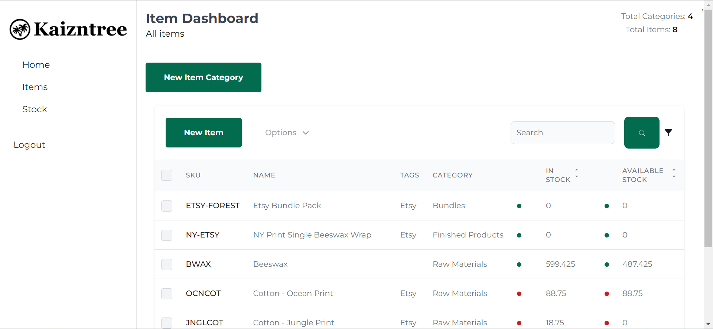

### Step to run

Clone the Repository

## Backend

1. Move to kaizntree-be
2. ` python manage.py makemigrations kaizntree`
3. ` python manage.py migrate`
4. Run DB dump by `python manage.py loaddata initial_data.json`
5. ` python manage.py runserver`

## Frontend

1. Move to kaizntree-fe
2. Add `VITE_API_URL=http://127.0.0.1:8000/api` to `.env` file
3. Run `npm i`
4. Run `npm run dev`

### Desktop View

[Desktop View](desktop.mp4)

### Mobile View

[Mobile View](responsive.mp4)

### Screenshots

### Step to run

Clone the Repository

## Backend

1. Move to kaizntree-be
2. ` python manage.py makemigrations kaizntree`
3. ` python manage.py migrate`
4. Run DB dump by `python manage.py loaddata initial_data.json`
5. ` python manage.py runserver`

## Frontend

1. Move to kaizntree-fe
2. Add `VITE_API_URL=http://127.0.0.1:8000/api` to `.env` file
3. Run `npm i`
4. Run `npm run dev`

### Desktop View

[Desktop View](desktop.mp4)

### Mobile View

[Mobile View](responsive.mp4)
